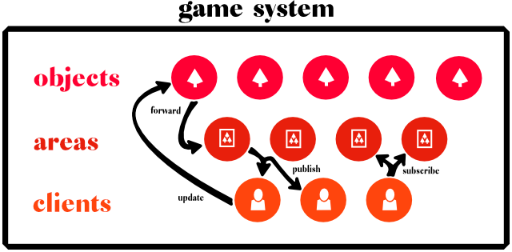

# Abune.Server

**ABUNE** stands for 'Actor Based Udp Network Engine'.

SOURCE CODE IS COMING SOON!

This game server implementation is a based on [Akka.net](https://github.com/akkadotnet/akka.net) and provides a highly scalable actor based runtime primarily for games based on [.NET core](https://github.com/dotnet/core) (like f.e. unity based games).

## Key features
- **large player count** - linearly scaling of network, cpu and memory with Akka.NET cluster technology
- **huge game worlds** - nearly unlimited amount of game objects using Akka.NET sharding technology
- **low latency** - reach every object and client within one hop in less than 10 ms using the reactive nature of Akka.net
- **realiable udp** - quality of service layer on top of udp protocol

## Concept

### Game system

### Restrictions
- **no lockstep** due to massive parallelism
- **restricted server side game logic** due to light weight actor based system (constraints logic for anti cheat)

## Build Status

### Documentation and resources
TBD

## Support
TBD

